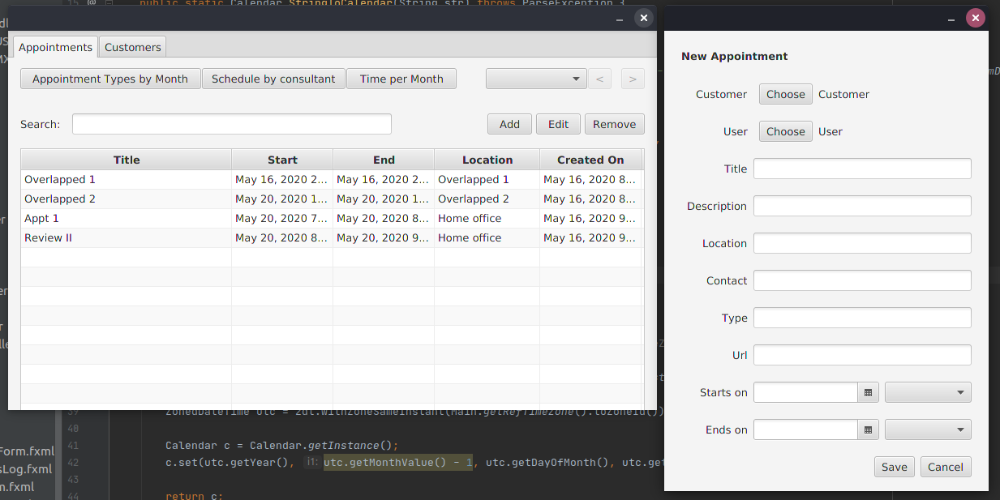
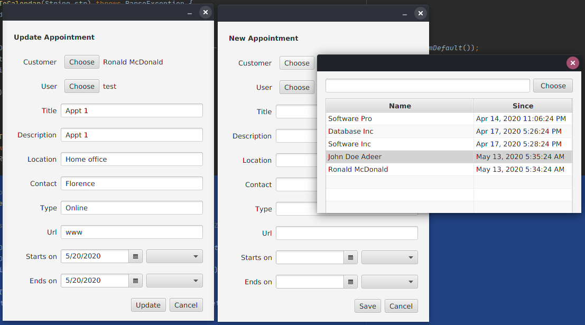

# Scheduler

## Scenario

You are working for a software company that has been contracted to develop a scheduling desktop user interface application. The contract is with a global consulting organization that conducts business in multiple languages and has main offices in Phoenix, Arizona; New York, New York; and London, England. The consulting organization has provided a MySQL database that your application must pull data from. The database is used for other systems and therefore its structure cannot be modified.

## Features

- Multi-language
- Timezone agnostic
- Telemetry
- Management of Appointments
    - Avoid overlapped appointments
    - Alert of appointments within 15 minutes from logging-in
    - Form validations
- Management of Customers
    - Form validations

# Database

The system communicates to the database by implementing the DAO pattern.

# Screenshots

- 
- 

# Contact

- [@mariomenjr](https://twitter.com/mariomenjr)
- [@mariomenjr](https://instagram.com/mariomenjr)